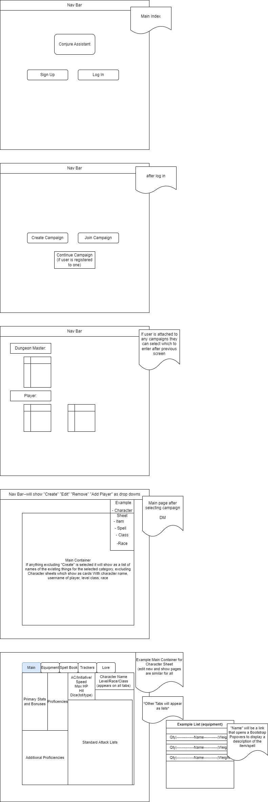
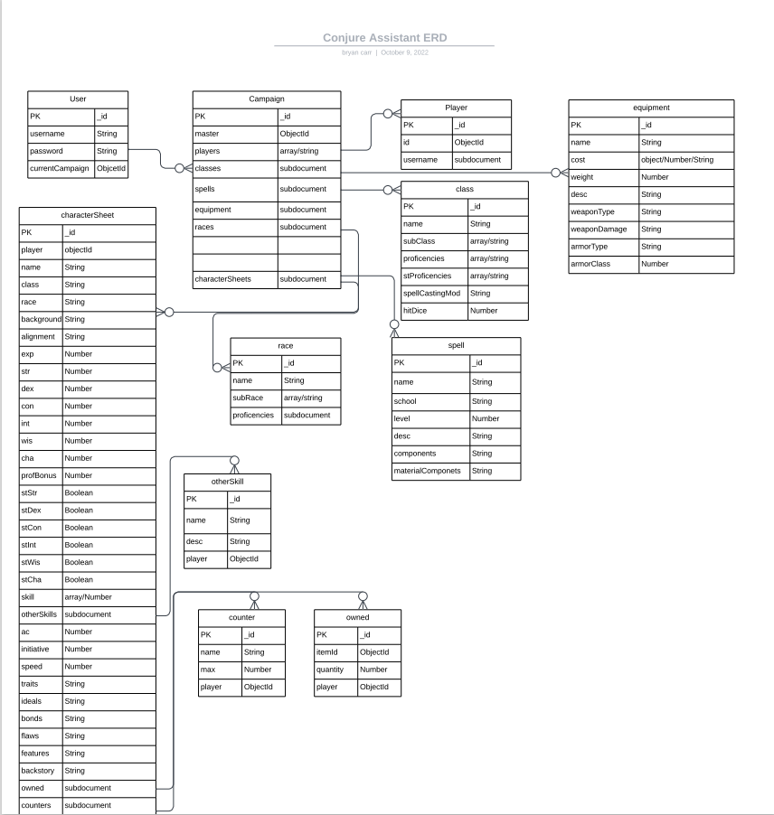

# Conjure Assistant

## Overview
---
Conjure Assistantis an app that allows users to digitally manage character sheets for Dungeons & Dragons Fifth Edition. Users can create resources for a campaign (as the Dungeon Master), or join others (as a player). This app utilizes the [Open 5e API](https://open5e.com/), to initialize a new campaigns resources, but after that each resource is controlled by the Dungeon Master who created the campaign. What does this mean? A lot! Think fireball is too powerful? Delete it! Think there should be more magic battle axes? Create it!
This also means that users can add resources found in the standard game materials that aren't included in the [SRD](https://5thsrd.org/) for a more robust collection of resources.

### Technologies Used:
- HTML5
- CSS (Bootstrap)
- JavaScript
- LiquidJs
- Express
- MongoDB/Mongoose

## User Stories
---
- As a user, I want the ability to create a new account.
- As a user, I want the ability to log in to my account.
- As a user, I want the ability to start new campaign -or- join an existing campaing -or- continue with a campaign I am already part of.
- As a user, I want the ability to log out at any time.
### If campaign owner (Dungeon Master):
- As a dungeon master, I want the ability to allow players to join my campaign.
- As a dungeon master, I want the ability to view and edit any player's character sheets.
- As a dungeon master, I want the ability to view, edit, create, and delete any resource (items, spells, classes, subclasses, races, etc.).
### If campaign member (Player):
- As a player, I want the ability to create, view, and edit my character sheet.
- As a player, I want the ability to create, view, modify, and remove resource trackers (current HP, spell slots, ki points, etc.).

## Wireframes
---

## ERD's
---

## API Usage
---
https://api.open5e.com :
- /weapons
- /armor
- /magicitems
- /classes
- /races
- /spells
- /feats

## Schedule for Delivery
---
### Monday
- Begin backend paths
- Test scripts for creating seed from API
### Tuesday
- Continue Backend
### Wednesday
- Continue Backend
- Start Front End
### Thursday
- Continue Front End
### Friday
- Finalize App and begin work on stretches