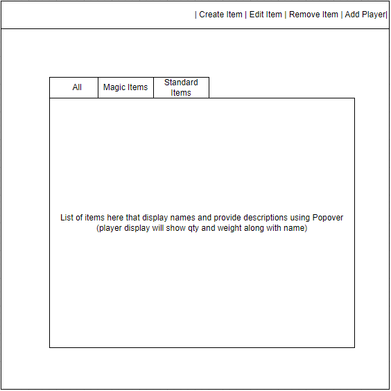
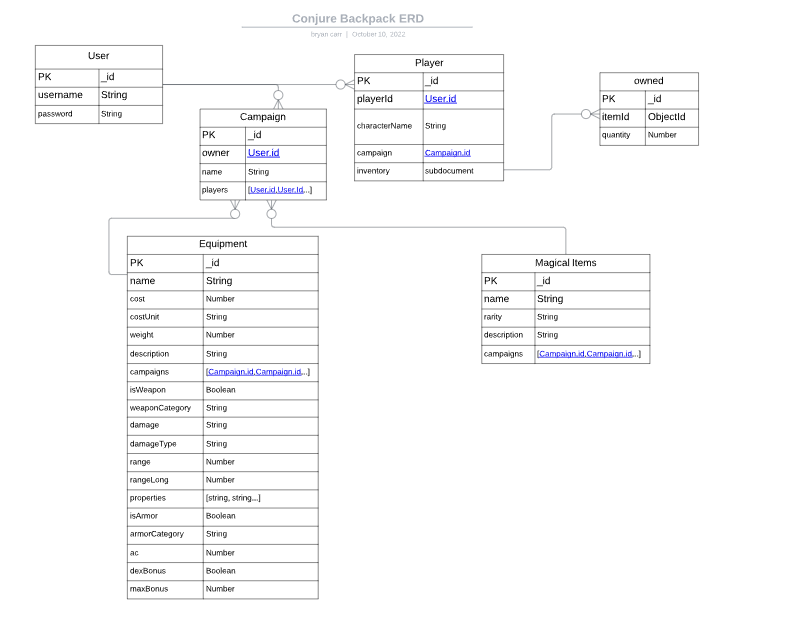

# Conjure Backpack
### A Dungeon's and Dragons 5e inventory manager

## Overview
---
Conjure Backpack is an app that allows users to digitally manage character inventories for Dungeons & Dragons Fifth Edition. Users can create campaigns (as the Dungeon Master) to manage the available items, or join others (as a player). This app utilizes the [DND 5e API](https://dnd5eapi/) to seed initial equipment available from the SRD. Dungeon Masters can choose to remove any of these items from their campaign (all are available by default), and of course, create their own.
This also means that users can add resources found in the standard game materials that aren't included in the [SRD](https://5thsrd.org/) for a more robust collection of resources.

### Technologies Used:
- HTML5
- CSS (Bootstrap)
- JavaScript
- LiquidJs
- Express
- MongoDB/Mongoose

## User Stories
---
- As a user, I want the ability to create a new account.
- As a user, I want the ability to log in to my account.
- As a user, I want the ability to start new campaign -or- join an existing campaing -or- continue with a campaign I am already part of.
- As a user, I want the ability to log out at any time.
### If campaign owner (Dungeon Master):
- As a dungeon master, I want the ability to allow players to join my campaign.
- As a dungeon master, I want the ability to view and edit any player's inventory.
- As a dungeon master, I want the ability to view, edit, create, and remove any item in my campaign.
### If campaign member (Player):
- As a player, I want the ability to create, view, and edit my backpack.

## Wireframes
---

---

## ERD's
---

## API Usage
---
API is only used for the initial seed of the DB, afterwhich all items are contained and formated for the internal API

https://dnd5eapi.co/api :
- /equipment
- /magic-items

## Schedule for Delivery
---
### Monday
- Begin backend paths
- Test scripts for creating seed from API
### Tuesday
- Continue Backend
### Wednesday
- Continue Backend
- Start Front End
### Thursday
- Continue Front End
### Friday
- Finalize App and begin work on stretches